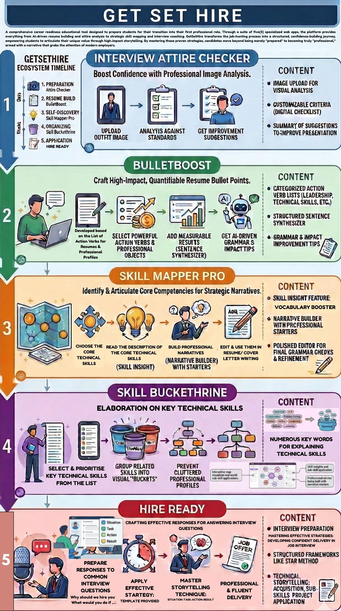

# 🚀 GET SET HIRE

**GET SET HIRE** is a comprehensive career readiness educational tool designed to prepare students for their transition into their first professional role. Through a suite of five(5) specialized web apps, the platform provides everything from AI-driven resume building and attire analysis to strategic skill mapping and interview coaching. GetSetHire transforms the job-hunting process into a structured, confidence-building journey, empowering students to articulate their unique value through high-impact storytelling. By mastering these proven strategies, candidates move beyond being merely "prepared" to becoming truly "professional," armed with a narrative that grabs the attention of modern employers.

---

## 🛠️ The 5 TOOLS

1.  **Interview Attire Checker** - Professional image analysis to boost first-impression confidence.
2.  **BulletBoost** - AI-powered resume enhancer that quantifies achievements using high-impact action verbs.
3.  **Skill Mapper Pro** - A tool to identify core competencies and build strategic career narratives.
4.  **Skill Buckethrine** - A visual framework allows users to categorize skills and elaborate on their technical skills. 
5.  **Hire Ready** - An interview preparation suite utilizing the STAR method and technical storytelling.

---

## 🔒 Access & Security
This platform is a protected educational tool. 
- **Admin Access:** Entrance to the main hub requires a password provided by the administrator.
- **Technology:** Built with HTML5, CSS3, and JavaScript, hosted via GitHub Pages.

---

## 📊 Analytics & Impact
This project utilizes **Google Analytics** to track student engagement and tool usage, ensuring continuous improvement based on user interaction data.

---

## 👤 Project Lead
**[ Catherine]**
*Developed for the transition of students into their first professional roles.*

---
Copyright © 2026 [Catherine N.C.L]. All Rights Reserved.

No part of this application, including code, questions, and graphical assets, may be reproduced, distributed, or transmitted in any form or by any means without the prior written permission of the author.
